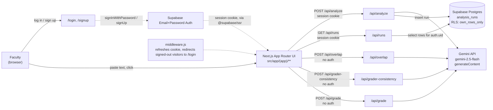
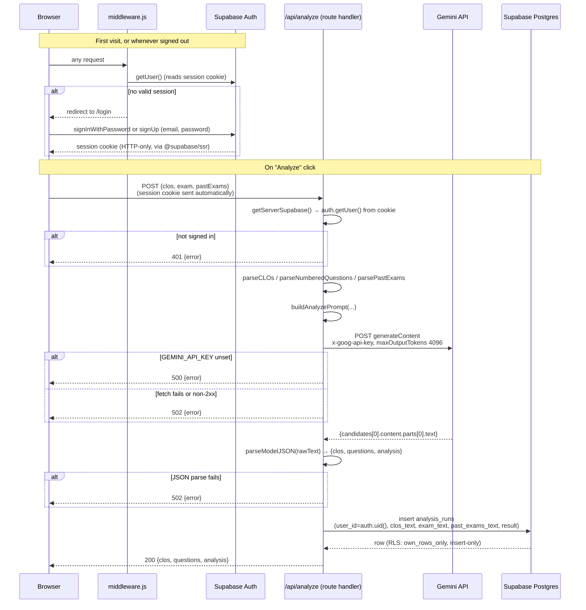
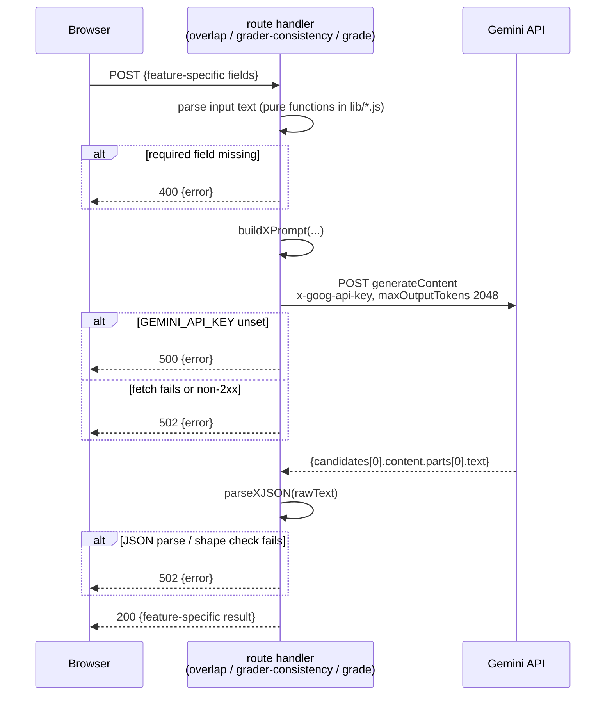
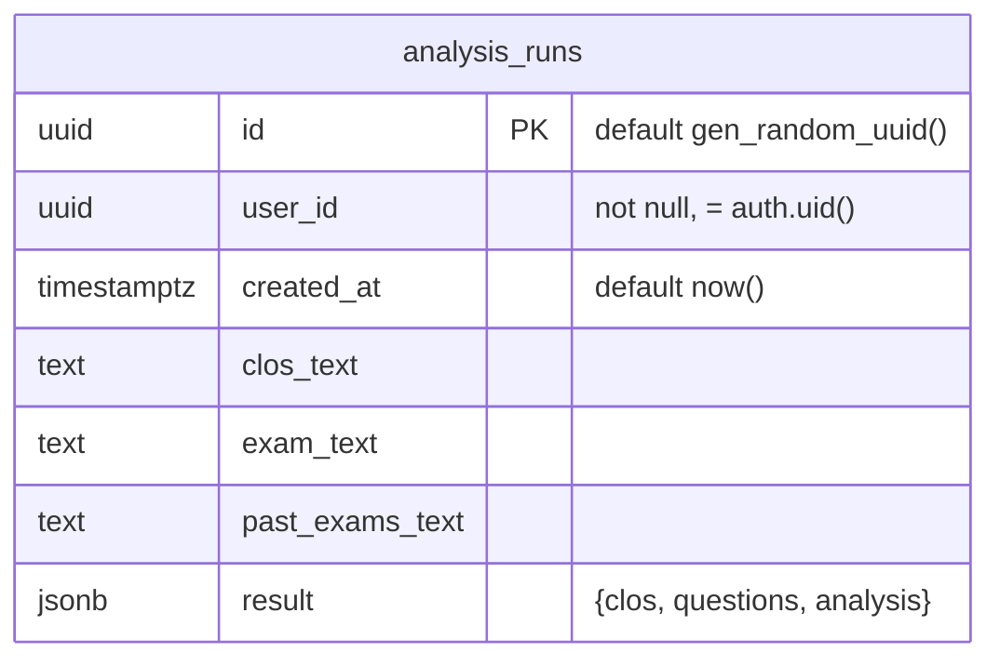
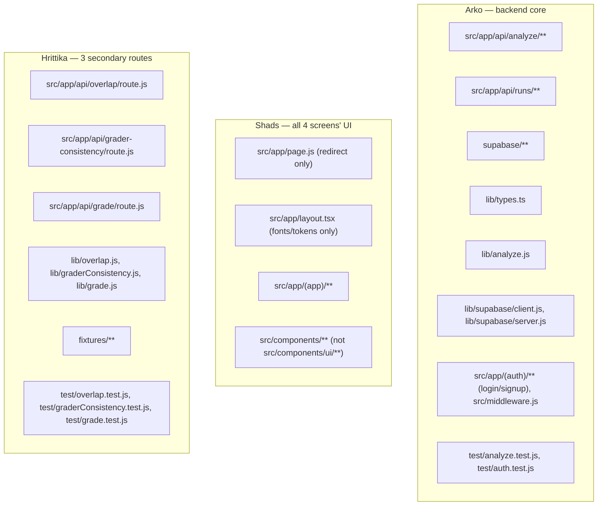
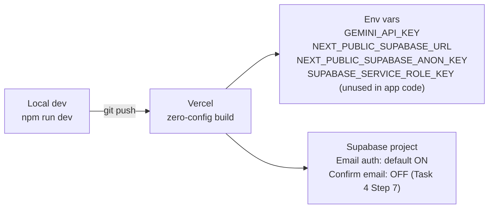

# Faculty OS — System Overview

One page to orient anyone (human or agent) picking this up cold. For the spec itself, see `plan.md` (PRD) and `DESIGN.md` (visual system); for execution details see `context.md` and the per-person `*_Plan.md` files. This file is a snapshot of *how the pieces fit together*, not a new source of truth — where it conflicts with `context.md`, `context.md` wins.

## 1. What it is, in one breath

Faculty pastes text (CLOs, exams, syllabi, rubrics, graded answers) into one of 4 screens. Each screen's "go" button hits one stateless-ish Next.js API route, which builds a prompt, calls Gemini once, parses the JSON back, and renders a report. Only one of the four screens (Exam Quality) persists its results, to one Supabase table, behind a real signed-in account. There is no file upload, no other backend.



Only `/api/analyze` and `/api/runs` touch Supabase in any way, and only they require a signed-in session. The other three routes are pure request → Gemini → response, no auth, no table.

> **Auth note (reversed 2026-09-06):** this app briefly used anonymous auth, then reverted to real email+password — see `plan.md`'s "Auth decision" and `context.md`'s "Auth" section. If you see anonymous-auth code (`signInAnonymously`, bearer-token verification in route handlers) being planned or written anywhere, that's the dead design now.

## 2. Build status right now (2026-09-06)

This is a hackathon repo mid-build. As of this writing, the repo has:

| Layer | State |
|---|---|
| Scaffold | ✅ Next.js 16 + TS `src/` layout, Tailwind 4, shadcn/ui "New York", Supabase browser client (`src/lib/supabase.ts`) |
| `lib/overlap.js` (Hrittika, pure logic: `parseTopics`, `parseExistingSyllabi`, `buildOverlapPrompt`, `parseOverlapJSON`) | ✅ written |
| `test/overlap.test.js` | ✅ written |
| Everything else in the table below (routes, DB migration, other 2 lib files, all UI screens) | ⏳ not yet created |

Nothing in `src/app/api/**` exists yet — the diagrams and contracts below describe the *target* architecture every plan is building toward, not code that's live today. Re-run `git status` / `git log` before assuming a task is done; the plans' own Task 0 says the same.

## 3. Tech stack

| Layer | Choice |
|---|---|
| Frontend | Next.js 16 (App Router, `src/` layout), React 19, TypeScript + plain JS/JSX mixed, Tailwind 4, shadcn/ui |
| Motion | GSAP — one wow-moment stagger reveal only (`DESIGN.md`) |
| Font | Plus Jakarta Sans |
| LLM | **Google Gemini** (`gemini-2.5-flash`), native `fetch`, no SDK |
| Auth | Supabase real email+password auth (`@supabase/ssr`, `@supabase/supabase-js`) — login/signup pages, cookie session, `middleware.js` |
| Database | Supabase Postgres, one table, RLS as the only trust boundary |
| Tests | Node built-in `node:test` (`node --test test/`) — no Jest/Vitest |
| Deploy | Vercel, zero-config |

## 4. The 4 screens / 6 features

Each row is one screen; a screen may bundle multiple PRD feature numbers behind a single API call.

| Screen | Features (# from `plan.md`) | Route | Persists? |
|---|---|---|---|
| Exam Quality | #1 Exam Quality Check, #5 CLO Coverage Matrix, #4 Dedup & Tagging | `POST /api/analyze` | **Yes** → `analysis_runs`, visible via `GET /api/runs` |
| Syllabus Overlap | #3 Syllabus/Curriculum Overlap | `POST /api/overlap` | No |
| Grader Consistency | #2 Multi-Grader Consistency | `POST /api/grader-consistency` | No |
| AI-Anchored Grading | #8 AI-Anchored Rubric Scoring | `POST /api/grade` | No |

Exam Quality's three features share one LLM call because they're one user-visible flow (paste CLOs + draft exam + past exams once, get a coverage matrix + recycled-question list + Bloom tags back together) — not because they outrank the other three.

## 5. Request flow — the one persisted route (`/api/analyze`)



`GET /api/runs` is the read side of the same table: session cookie in, `select * from analysis_runs where user_id = auth.uid()` (enforced by RLS, not app code), `{runs: [...]}` out. No insert, no update, no delete ever issued against this table by app code — RLS policy only grants `select`/`insert`.

## 6. Request flow — the three stateless routes

`/api/overlap`, `/api/grader-consistency`, `/api/grade` are identical in shape to each other and simpler than `/api/analyze`: no auth header, no database.



Every route in the app returns the same error envelope — `{error: string}` — with status codes fixed by contract: **400** missing input, **401** bad/missing auth (analyze/runs only), **500** missing `GEMINI_API_KEY`, **502** upstream Gemini failure or unparseable JSON. Only the error *text* differs per provider/route; the shape and codes never do.

## 7. Data model



One table, total. RLS policy `own_rows_only`: `using (auth.uid() = user_id)`, grants `select` + `insert` only — no `update`/`delete`, so history is immutable by construction. The other three features have no table: their whole lifecycle is one request → one response, nothing written anywhere.

## 8. Response shapes (the Frozen Contract)

```
CLO               { id, text }
Question          { number, text }
QuestionAnalysis  { questionNumber, coveredCLOs: string[], topic, bloom, similarity: SimilarityMatch | null }
SimilarityMatch   { year, matchedQuestion, percent, reason }
OverlapItem       { topic, overlapPercent, existingCourse }
ConsistencyFlag   { answerA, answerB, scoreA, scoreB, grader }
GradeResult       { answer, humanScore: number | null, aiScore, delta, reason }
```

Each workstream keeps its **own local copy** of these shapes rather than importing a shared file — the one deliberate duplication in the codebase, so that Shads' frontend never blocks on Arko's backend types compiling first. See `plan.md`'s "Shared-file risk" section.

## 9. File ownership (who can touch what)



No two people's files overlap by design. If two plans would ever touch the same file, that's a stop-and-flag situation, not something to resolve unilaterally (see `AGENTS.md`).

## 10. Deployment & environment



`SUPABASE_SERVICE_ROLE_KEY` is provisioned but must **never** appear in application code — the cookie-based session + RLS is the entire trust boundary. `GEMINI_API_KEY` replaces every `ANTHROPIC_API_KEY` reference still present in the older plan docs (`Arko_Plan.md`, `Hrittika_Plan.md`, `Backend_Plan.md`) — see `context.md`'s "LLM provider" section for why those docs still show Anthropic code samples that were never meant to be built.

## 11. Known deviations worth remembering

- **`src/` + TypeScript scaffold, not the plans' assumed root `app/` + plain JS.** Every `app/**`/`components/**` path in the per-person plans needs a mental `src/` prefix, and relative imports inside moved files need one extra `../`. `middleware.js` specifically goes to `src/middleware.js`, not repo root. Full detail: `context.md`'s deviation section.
- **Gemini, not Anthropic**, everywhere an LLM is called — the migration is a single fetch-block swap per route (§2 above), the surrounding parse/prompt logic is unchanged. `Master_Tasklist.md` §2 has the exact before/after code.
- **Auth flip-flopped, and real auth won.** `plan.md` first went anonymous (`signInAnonymously()`, no login pages), then reversed back to real email+password (`Backend_Plan.md`'s original design, reinstated 2026-09-06) — see `plan.md`'s Auth decision section and `context.md`'s "Auth" section. `Arko_Plan.md` Tasks 1/4/5/6/7 were rewritten accordingly. If you see anonymous-auth code (`signInAnonymously`, bearer-token verification in a route handler) being planned or written, that's the dead design now — stop.
